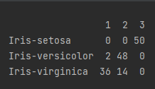
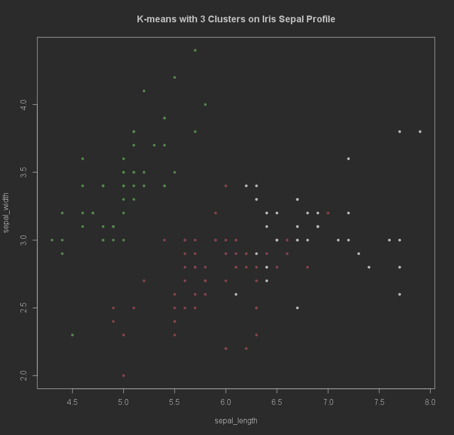
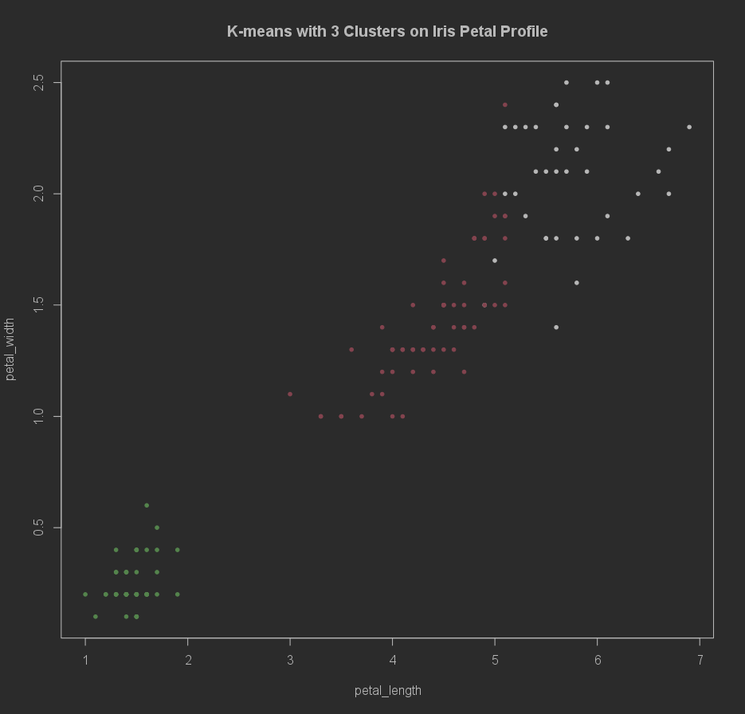

# <div style="text-align: center;">CIS6030 Information System</div>

## <div style="text-align: center;">Assignment 4</div>

## <div style="text-align: center;"> Enshen Zhu (1194726)</div>

****

### General Background

This assignment is going to use the Hadoop HDFS to store the input data and later import them from the HDFS into the R
development environment. Same to the issue in the Assignment 2, since Hadoop is extremely hard to be properly installed
and configured on the Windows OS. This assignment uses the Windows Docker Desktop to imply the Hadoop Cluster, as well
as fulfilling multiple WordCount functions.

### How To Use

Same to the Assignment 2, to imply the Hadoop Cluster on the Docker, we need to firstly install the Docker Desktop on
the Windows, and then settle the Hadoop Cluster on the Docker.

#### I. Install Docker Desktop

Please kindly review this [official installation guidance](https://docs.docker.com/desktop/install/windows-install/)

To verify the integrity of the Docker Desktop, please open the terminal and enter the following commands

```
$ docker --version
$ docker compose --version
```

You should correctly view up the version of Docker Desktop on your machine.

#### II. Set Up the Hadoop Cluster on the Docker Desktop

1. Use git to download the Hadoop Docker files from
   the [Big Data Europe repository](https://github.com/big-data-europe/docker-hadoop)

   ```$ git clone https://github.com/big-data-europe/docker-hadoop.git```
2. Open the terminal from the folder and enter the following

   ```docker-compose up -d```

   This command will deploy the Hadoop Cluster onto the docker

3. You can also check the running status of the containers inside the docker by the following command

   ```docker ps```

#### III. Transfer the two csv files into the HDFS

1. <b>Download and place the iris.csv and multishapes.csv file <em>(RECALL: Due to the assignment requirement, the
   required datasets are not inside the submission folder. Please kindly attach the data file by yourself!)</em> to the
   cloned repo</b>
2. In the terminal, enter ```docker exec -it namenode bash``` to get into the namenode bash terminal. A similar
   interface may look like follow

   ```
   winni@Frontier MINGW64 /d/Guelph_Master/CIS6030 Information System/CIS6030_Assignment/CIS6030_Assignment4/docker_hadoop (main)
   $ docker exec -it namenode bash
   root@e3c4e66e5dc3:/#
   ```
3. Create a input directory inside the namenode:/tmp by
   ```
   cd tmp
   mkdir input
   ```
4. Exit the namenode bash terminal by entering ```exit```
5. Copy the documents and data to the namenode/tmp by (Please make sure you are no longer inside the namenode bash
   terminal)

   ```
   docker cp iris.csv namenode:/tmp/input
   docker cp multishapes.csv namenode:/tmp/input
   ```

##### IV. Sync the input data to the Hadoop HDFS

1. Get into the namenode bash by  ```docker exec -it namenode bash```
2. Get into the tmp folder by ```cd tmp```
3. Create a hdfs directory named input by ```hadoop fs -mkdir -p input```
4. Place the input files in all the datanodes on HDFS by ```hdfs dfs -put ./input/* input```

### Results

#### I. K-Mean Clustering

##### A. Iris

1. The script is inside the kmean folder and named as the *kmean_iris.rmd*
2. Since there are three different types of Iris flowers inside the dataset, we are going to manually set the k_value
   for 3 to facilitate the clustering.
3. The confusion matrix is shown as followed:

   

4. The visualized cluster results for both sepal profile and petal profile are shown as followed:

   

   

### When Finished

1. Leave the namenode bash by entering ```exit```
2. Shutdown the Hadoop cluster by entering ```docker-compose down```

### Reference

1. https://cjlise.github.io/hadoop-spark/Setup-Hadoop-Cluster/
2. https://hadoop.apache.org/docs/stable/hadoop-mapreduce-client/hadoop-mapreduce-client-core/MapReduceTutorial.html
3. https://www.youtube.com/watch?v=dLTI2HN9Ejg&t=401s