# <div style="text-align: center;">CIS6030 Information System</div>

## <div style="text-align: center;">Assignment 4</div>

## <div style="text-align: center;"> Enshen Zhu (1194726)</div>

****

### General Background

This assignment is going to use the Hadoop HDFS to store the input data and later import them from the HDFS into the R
development environment. Same to the issue in the Assignment 2, since Hadoop is extremely hard to be properly installed
and configured on the Windows OS. This assignment uses the Windows Docker Desktop to imply the Hadoop Cluster.

### How To Use

Same to the Assignment 2, to imply the Hadoop Cluster on the Docker, we need to firstly install the Docker Desktop on
the Windows, and then settle the Hadoop Cluster on the Docker.

#### I. Install Docker Desktop

Please kindly review this [official installation guidance](https://docs.docker.com/desktop/install/windows-install/)

To verify the integrity of the Docker Desktop, please open the terminal and enter the following commands

```
$ docker --version
$ docker compose --version
```

You should correctly view up the version of Docker Desktop on your machine.

#### II. Set Up the Hadoop Cluster on the Docker Desktop

1. Use git to download the Hadoop Docker files from
   the [Big Data Europe repository](https://github.com/big-data-europe/docker-hadoop)

   ```$ git clone https://github.com/big-data-europe/docker-hadoop.git```
2. Open the terminal from the folder and enter the following

   ```docker-compose up -d```

   This command will deploy the Hadoop Cluster onto the docker

3. You can also check the running status of the containers inside the docker by the following command

   ```docker ps```

#### III. Transfer the two csv files into the HDFS

1. <b>Download and place the iris.csv and multishapes.csv file <em>(RECALL: Due to the assignment requirement, the
   required datasets are not inside the submission folder. Please kindly attach the data file by yourself!)</em> to the
   cloned repo</b>
2. In the terminal, enter ```docker exec -it namenode bash``` to get into the namenode bash terminal. A similar
   interface may look like follow

   ```
   winni@Frontier MINGW64 /d/Guelph_Master/CIS6030 Information System/CIS6030_Assignment/CIS6030_Assignment4/docker_hadoop (main)
   $ docker exec -it namenode bash
   root@e3c4e66e5dc3:/#
   ```
3. Create a input directory inside the namenode:/tmp by
   ```
   cd tmp
   mkdir input
   ```
4. Exit the namenode bash terminal by entering ```exit```
5. Copy the documents and data to the namenode/tmp by (Please make sure you are no longer inside the namenode bash
   terminal)

   ```
   docker cp iris.csv namenode:/tmp/input
   docker cp multishapes.csv namenode:/tmp/input
   ```

##### IV. Sync the input data to the Hadoop HDFS

1. Get into the namenode bash by  ```docker exec -it namenode bash```
2. Get into the tmp folder by ```cd tmp```
3. Create a hdfs directory named input by ```hadoop fs -mkdir -p input```
4. Place the input files in all the datanodes on HDFS by ```hdfs dfs -put ./input/* input```

### Results

*Make sure the Docker Desktop is running*

#### I. K-Mean Clustering

##### A. Iris

1. The script is inside the kmean folder and named as the *kmean_iris.rmd*
2. Since there are the original dataset labelled data into six different classes, we are going to manually set the
   k_value for 6 to facilitate the clustering.
3. The confusion matrix is shown as followed:

   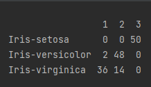

   In general, the cluster 1 should be the Iris-virginica, the cluster 2 should be the Iris-versicolor and the cluster 3
   should be the Iris-setosa.

   Accordingly, the data from Iris-setosa are mostly clustered correctly, by which is labelled in green dots. This is
   because Iris-setosa has dramatically smaller petal and sepal profile (both in length and width).

   However, since data from Iris-virginica and Iris-versicolor (labelled in white and red) have very similar petal and
   sepal profile, the k-mean may not able to properly cluster them. Therefore, several data points from Iris-virginica
   and Iris-versicolor are mistakenly labelled into the false cluster.

4. The visualized cluster results for both sepal profile and petal profile are shown as followed:

   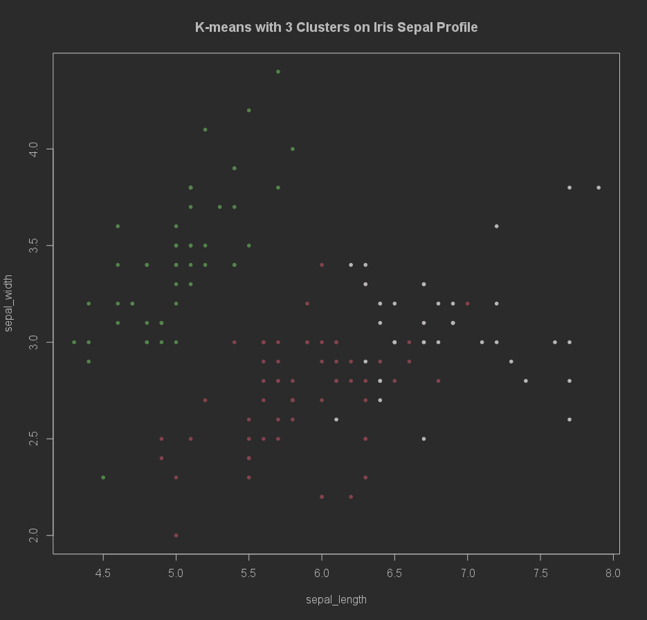

   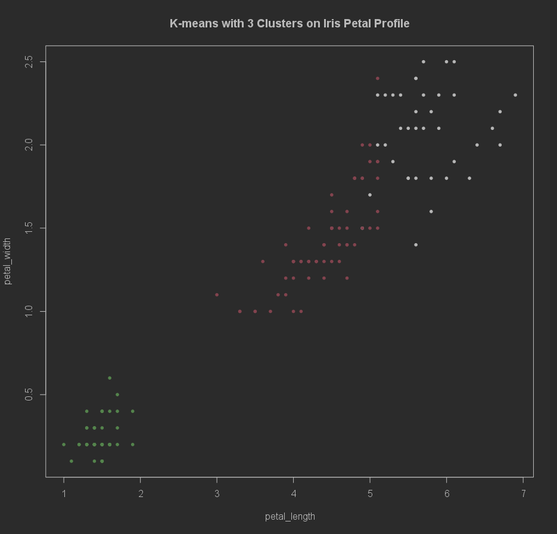

   Cluster 3, which is labelled in green, is clearly spared from the Cluster 1 and the Cluster 2.

##### B. Multishape

1. The script is inside the kmean folder and named as the *kmean_multishape.rmd*
2. Since there are three different types of Iris flowers inside the dataset, we are going to manually set the k_value
   for 3 to facilitate the clustering.

3. The visualized cluster result is shown as followed:

   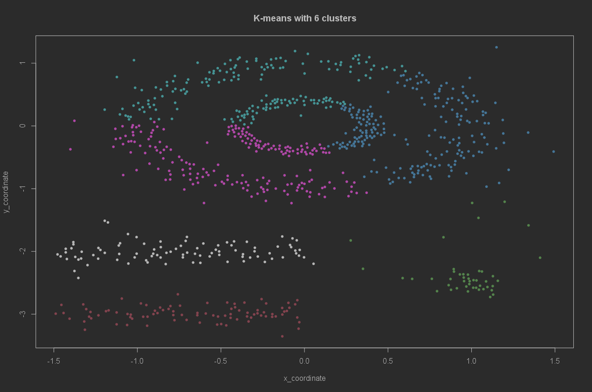

4. The confusion matrix is shown as followed:

   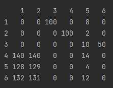

   To clarify the meaning of the above confusion matrix, the row index for each row represents the real label originally
   from the dataset, and the column index for each column represents the predicted cluster index from the k-mean
   clustering.

   Due to the limitation of the library-built k-mean clustering, the predicted cluster index and the real cluster index
   may not match with each other. However, we can find that the predicted cluster 4,5,and 6 are inside the two rings
   located at the right top of the graph. Besides, the predicted cluster 1 and 2 are located at the left bottom of the
   graph. Additionally, the predicted cluster 3 is located at the right bottom of the graph.

#### II. HDBSCAN

##### A. Iris

1. The script is inside the hdbscan_manual folder and named as the *hdbscan_iris.rmd*
2. We *set the k_param and MCS value to be 5*. The confusion matrix and the visualized result, for both sepal and petal,
   are shown as followed:

   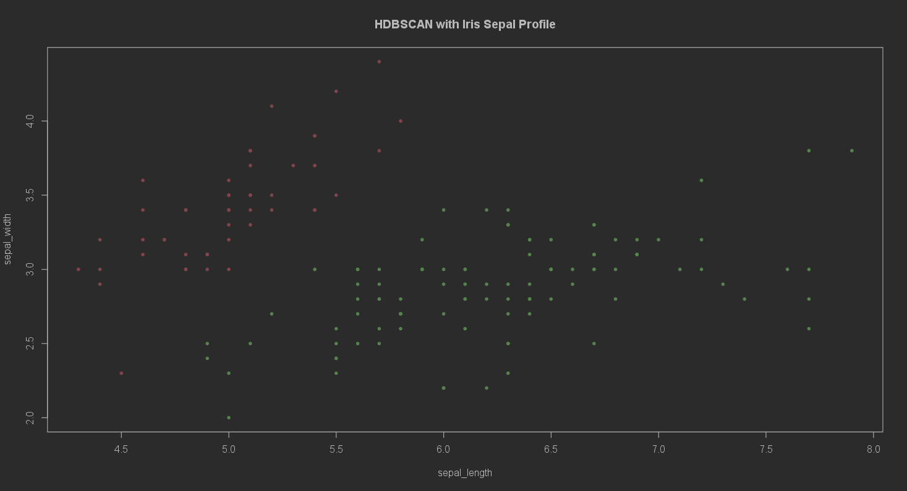

   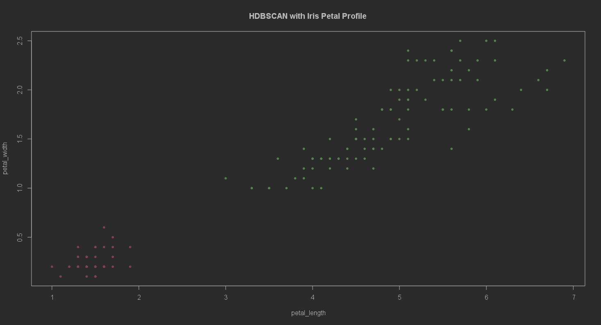

3. The confusion matrix is shown as followed

   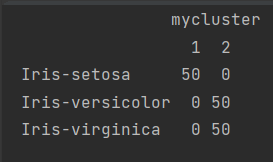

   The confusion matrix presents a very distinctive result, by which each Iris classes are either fully proper clustered
   or wrongly cluster completely. Specifically, since the Iris-virginica and Iris-versicolor have very similar sepal and
   petal profile, the HDBSCAN clusters them into one single cluster. However, as the data from the Iris-setosa has the
   identical sepal and petal profile, the HDBSCAN will not place them into other clusters.

4. With a relatively higher k_param and MCS value, some margin points of a cluster will be treated as the outlier and
   labelled in white. (the followed example shows teh visualized result and the confusion matrix when k_param and MCS
   become 30)

   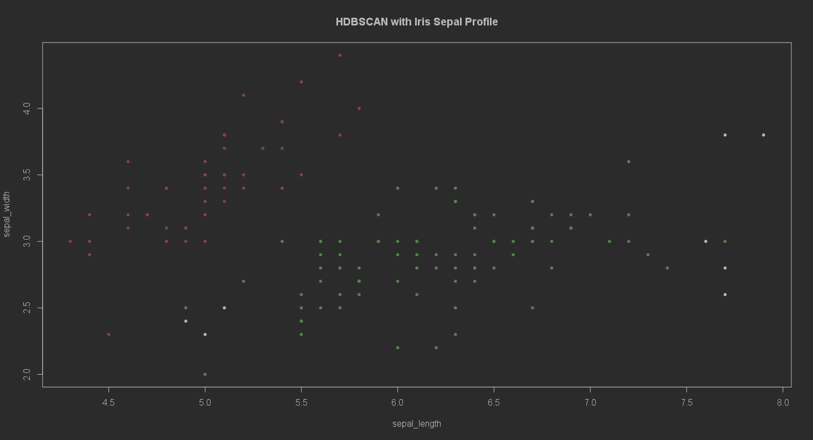

   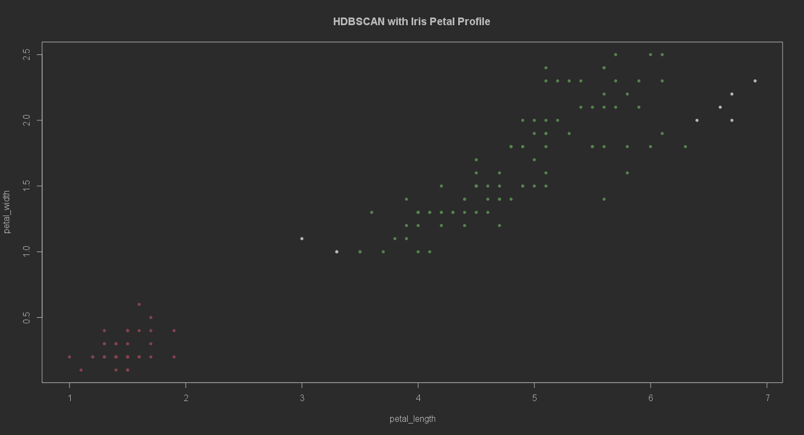

   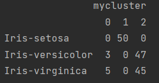

##### A. Multi-shape

1. The script is inside the hdbscan_manual folder and named as the *hdbscan_multishape.rmd*
2. We *set the k_param and MCS value to be 20*. The visualized results and the confusion matrix are shown as followed:

   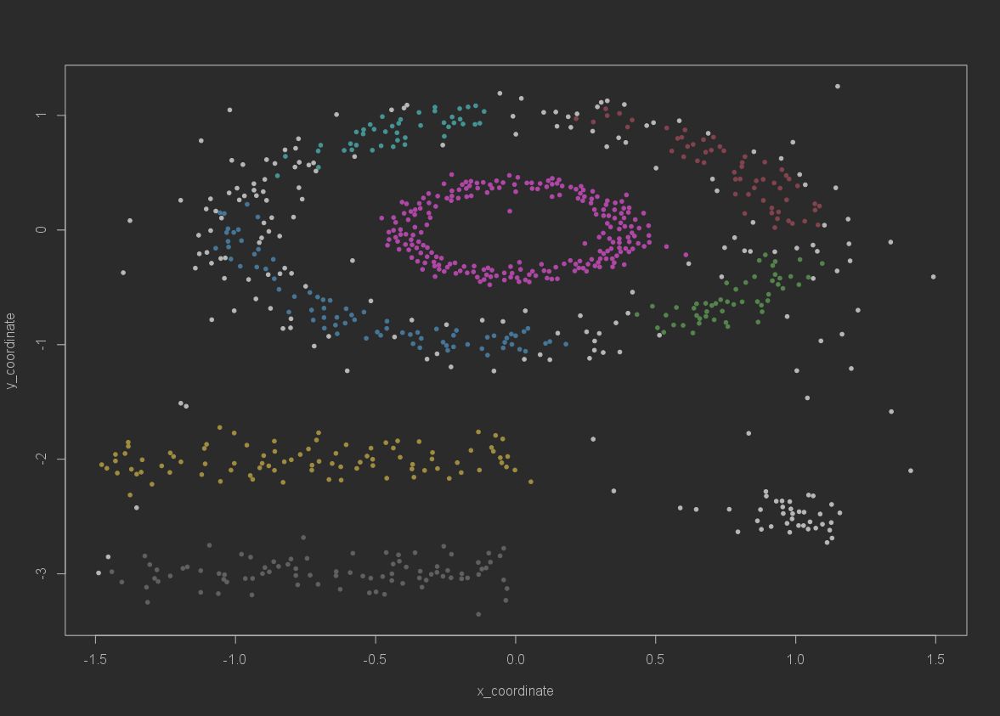

   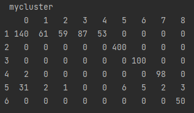

   Recall that in the confusion matrix, the row index are the real classified index from the original dataset, while the
   column index are the predicted cluster index. When both k_params and MCS are set to 20, there are way more predicted
   clusters than the originally labelled classes.
3. Let us keep the k_params as 5 and set MCS into a higher value as *27*. The results are shown as follows.

   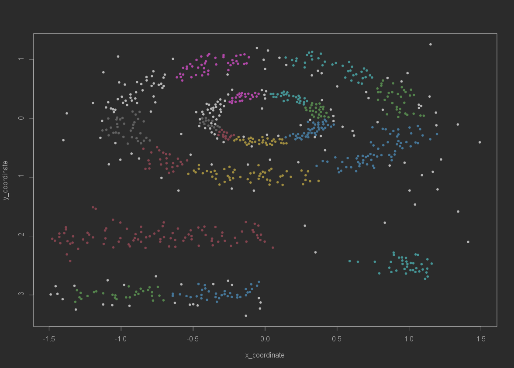

   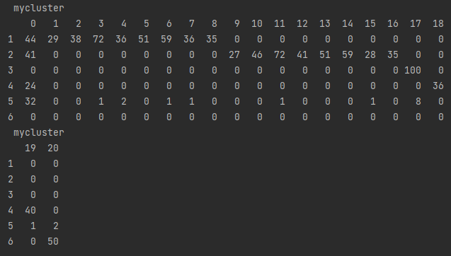

   In this case, the confusion matrix has more predicted clusters, and the visualized result becomes really messy.

4. Set both the k_params and MCS into 27

   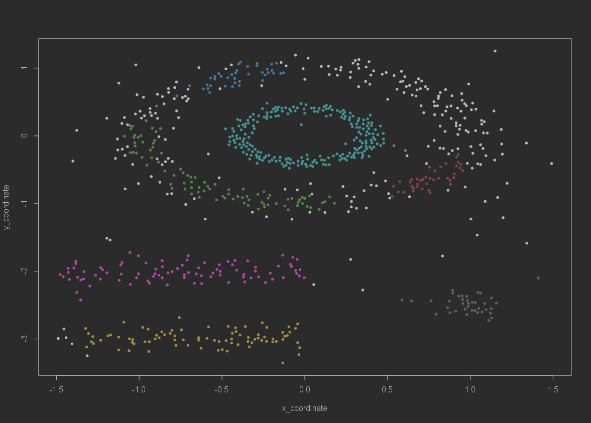

   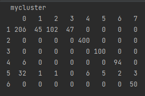

   Compare to the case when k_params=20 | MCS=20, the visual result for k_params=27 | MCS=27 has one less predicted
   cluster.
5. Set both the k_params and MCS into 40 (Since the class 6 data points have the minimum size, which is 50, among the
   entire dataset, we need to make sure the MCS is below 50 to secure the meaningful clustering work)

   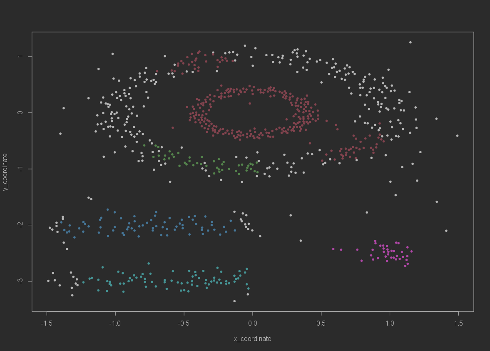

   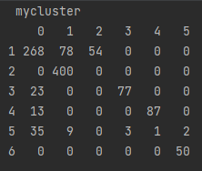

   When k_params and MCS all become 40, it generates 5 predicted clusters and 1 outlier collection, which matches up
   with the number of clusters (to be 6) from the original dataset. However, the confusion matrix shows that the numbers
   of outliers may be as much as the data points in clusters, and such cluster orientation may not be sematic for the
   purpose of doing clustering works.

### General Comparison

1. For the Iris dataset, The confusion matrix of the kmean clustering indicates a relatively high accuracy for each
   cluster. So we may commit that the kmean clustering have a well performance for the Iris dataset.

   In the meantime, since Iris-versicolor and Iris-virginica have very similar petal and sepal profile, the HDBSCAN (not
   take the anticipated numbers of clusters as an input) may consider this two types of Iris into a single cluster,
   which is also a rational result.

2. For the Multishape dataset. The kmean clustering may work well on the almost-linear distributed data (located at the
   left bottom in the following data-distributed graph), but completely mess up with clustering for some part of the
   dataset.

   

   For example, the top half of the above data-distributed graph should be semantically cluster into the inner ring and
   the
   outer ring. However, the kmean clustering just split it into three parts. This is becasue the kmean clustering may
   only have a good performance for circle-liked or ball-liked distributed dataset, but fail to work properly when
   encountering with the dataset that has a complex data distribution.

   Meanwhile, the HDBSCAN may have a better performance to handle some complex distributed data points than the kmean
   clustering. It correctly markout the inner ring as a cluster inside the data distributed graph.

   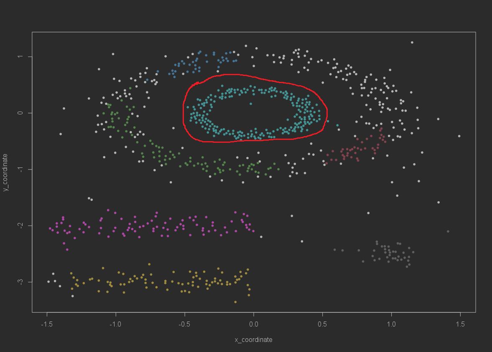

   However, it marks out too much points as outliers, and cannot properly markout the outer ring.
3. To improve the clustering quality for the multishape dataset, I tried on the *build-in DBSCAN libray*, and it can
   produce
   an excellent output for clustering (eps = 0.15, minPts = 5)
   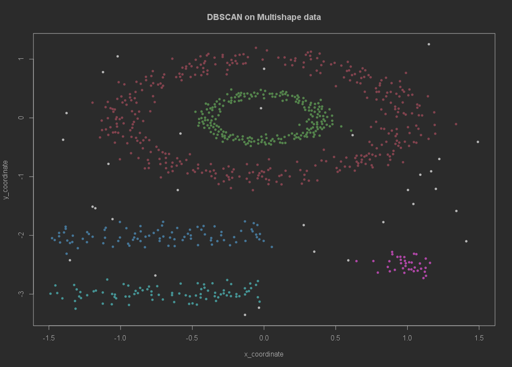

### When Finished

1. Leave the namenode bash by entering ```exit```
2. Shutdown the Hadoop cluster by entering ```docker-compose down```

### Reference

1. https://cjlise.github.io/hadoop-spark/Setup-Hadoop-Cluster/
2. https://hadoop.apache.org/docs/stable/hadoop-mapreduce-client/hadoop-mapreduce-client-core/MapReduceTutorial.html
3. https://www.youtube.com/watch?v=dLTI2HN9Ejg&t=401s